# Job Tracker — Mobile App (Expo)

A React Native mobile client for tracking job applications. Built with Expo and React Native Paper.

> **This app does not have its own backend.** It relies on the [Job Tracker Web App- Task 1](https://github.com/KwabenaSark/zeepay-task-1.git) running as the server. The Next.js web app handles all data storage and exposes the API that this mobile app consumes.

---

## Architecture

Both apps share the same data layer:



The Next.js app functions as the API server. The mobile app talks to it directly — **you must have the web app running before starting the mobile app.**

---

## Prerequisites

- [Node.js](https://nodejs.org/) 18+
- [Expo Go](https://expo.dev/go) installed on your phone, or an Android/iOS emulator /
- The Task 1 **web app running** e.g `http://localhost:3000`

---

## Setup

### 1. Clone and install

```bash
git clone <your-repo-url>
cd mobile
npm install
```

### 2. Create your `.env` file

Create a `.env` file in the root of the mobile project:

```properties
EXPO_PUBLIC_API_REMOTE_URL=http://localhost:3000
```

> **Note:** The local host has to be the one on which the next app is running.

### 3. Start the web app first

Make sure the Next.js web  app is running:

```bash
# In the web app directory
npm run dev
```

### 4. Start the Expo app

```bash
npx expo start
```


- `a` to open on --web or 
- `i` to open on iOS simulator

---

## Scripts


| Command                | Description                             |
| ---------------------- | --------------------------------------- |
| `npx expo start`       | Start the dev server                    |
| `npx expo start --web` | Run in browser                          |
| `npx expo run:android` | Run on local Android emulator           |
| `npx expo run:ios`     | Run on local iOS simulator              |
| `eas build`            | Build for production (requires EAS CLI) |


---

## Environment Variables


| Variable                     | Description                        |
| ---------------------------- | ---------------------------------- |
| `EXPO_PUBLIC_API_REMOTE_URL` | Base URL of the Next.js API server |


All Expo public variables must be prefixed with `EXPO_PUBLIC_` to be accessible in the app.